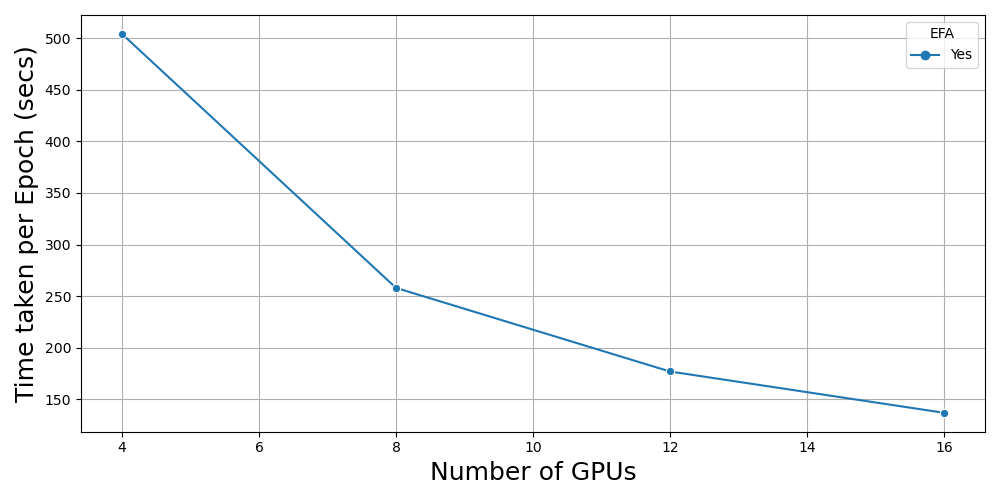

# Accelearte Distributed Training on AWS ParallelCluster

## 0. Prerequisites
We assume a Slurm cluster is already created. For a step-by-step set of instructions to create a cluster, please follow this [repo](https://github.com/aws-samples/aws-distributed-training-workshop-pcluster/tree/main)

Model: [scDINO](https://github.com/JacobHanimann/scDINO/tree/master) with Vision Transformers

## 1. Download Deep Phenotyping Image Data
Execute ./1-download-data.sh to download the image data, unzip it, create a S3 bucket pcluster-ml-workshop and upload to the S3 bucket. You can find more information about the dataset here. This dataset has 90852 images in the Training set and 22712 images in the Test set.

## 2. Approaches
1. NCCL Tests 
2. Scaling with EFA with a cluster of g4dn.12xlarge instances
4. Storage Strategy
5. PyTorch vs DALI dataloaders
7. Monitoring
8. Better Transformers
9. Fully Sharded Data Parallel

### NCCL Tests
Once a cluster is created, the first step is to make sure GPUs across different compute nodes are communicating efficiently. Follow steps in the [nccl_tests](https://github.com/awsankur/accelerate-pcluster-distributed-training/tree/main/nccl-tests) directory to make sure 1) tests run successfully and 2) the reported bus bandwidth for a given test is close to the theoretical bandwidth.

### Scaling with EFA

  

### Storage Strategy
These are the different places where you can store the training data. However, our recommendation is to store the training data in a FSx for Lustre filesystem.
#### S3 
You would need to stream data directly from S3. This approach will not only increase latency but also might lead to limitations in the data type support. For more information, see the [TorchData](https://github.com/pytorch/data) package. Or the [S3 plugin](https://github.com/aws/amazon-s3-plugin-for-pytorch)
#### FSx for Lustre
1. Create data repository association with S3 bucket in FSx console
2. Use df -h to see usage and availability of FSx filesystem
3. Monitor FSx throughput from console
4. [Preload file system](https://github.com/awsankur/accelerate-pcluster-distributed-training/blob/main/preload-file-system.sh). For more details see [here](https://docs.aws.amazon.com/fsx/latest/LustreGuide/preload-file-contents-hsm-dra.html)
5. [Release file system](https://github.com/awsankur/accelerate-pcluster-distributed-training/blob/main/release-file-system.sh)- This frees up the space in FSx for Lustre filesystem. You can still load data from the same path in FSx for Lustre filesystem. This is also referred as the lazy loading approach. However, the first epoch will be a bit slower. We noticed that the first epocj was ~3 times slower compared to other epochs. 
#### NVMe Drives
Each g4dn.12xlarge instance has upto 900GB of NVMe storage mounted at /local_scratch.

### PyTorch vs DALI dataloaders
See [here](https://github.com/awsankur/accelerate-pcluster-distributed-training/tree/main/nvidia-dali) for a comparison of PyTorch vs DALI dataloaders. Average time per epoch can be reduced by upto 95% with Nvidia DALI.

### Monitoring
Build your cluster with the [pcluster config](https://github.com/awsankur/accelerate-pcluster-distributed-training/blob/main/pcluster-configs/pcluster-with-monitoring-config.yaml). More details are [here](https://github.com/aws-samples/aws-parallelcluster-monitoring/tree/main)

